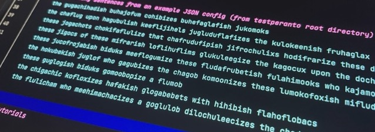

# testperanto
### a python package for generating artificial language

`testperanto` is designed to facilitate the generation of "linguistically realistic"
artificial languages. Among its intended uses:
- to investigate the inductive biases of neural models for specific linguistic typologies
- to provide realistic proxy data for developing models for low-resource languages

### getting started

#### installation (with anaconda, from testperanto root directory)

    conda create -n tpo python=3.8
    conda activate tpo
    pip install -e .

#### installation (with venv, from testperanto root directory)

    python3 -m venv tpo
    source tpo/bin/activate
    pip install -e .
    

#### running the unit tests (from testperanto root directory)

    python -m unittest

#### generating sentences from an example JSON config (from testperanto root directory)

    python scripts/generate.py -c examples/white/white.json --sents -n 5 -s 011101

### tutorials

`testperanto` comes with several tutorials to help learn how the
package can be used. These tutorials take the form of Jupyter Notebooks
and are located in the `/tutorials` subdirectory.

